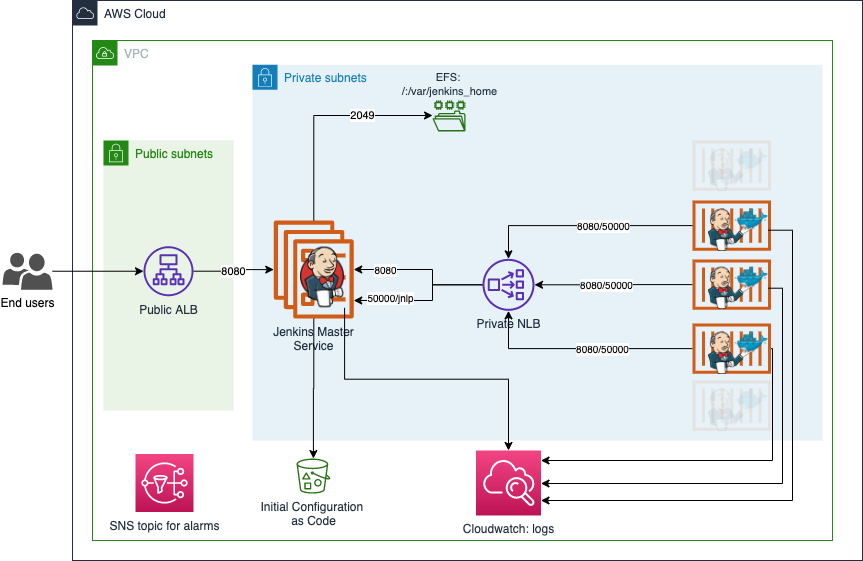

# Terraform Jenkins AWS ECS Fargate
Terraform stack to deploy Jenkins on ECS Fargate with Jenkins configuration stored in EFS and agents on Fargate too. 
Since the recent support for EFS in Fargate, we can now run a fully Serverless Jenkins on AWS.

This stack can be used as a starting point to build a production ready Jenkins on AWS. 

More details can be found on [my blog post](https://blog.haidara.io/post/jenkins-aws-fargate/) (in french).

## How it works
This stack will deploy Jenkins Master on ECS Fargate. It uses a docker image based on the [official Jenkins](https://github.com/jenkinsci/docker). See `docker/` folder.

The following main resources will be created:
 - An application load balancer in front of Jenkins.
 - A network load balancer for Agent -> Master communication. For more information about how Master <-> Agents communication works, see [this page](https://wiki.jenkins.io/display/JENKINS/Distributed+builds).
 - An EFS to store Jenkins configuration.
 - An S3 bucket used by the Jenkins Configuration as code plugin to get the configuration generated by Terraform.
 - Two log groups for the Master and agents logs



## Prerequisites
 - A VPC with public and private subnets configured properly (route table, nat gateways...)
 - An IAM user with the proper policies to run Terraform on the following services: EC2, ECS, IAM, S3, Cloudwatch, EFS, Route53 et ACM.
 - A recent version of Terraform ( > 0.12.20)

The only required Terraform variables are:
 - `vpc_id` : the VPC ID
 - `public_subnets` : public subnets IDs
 - `private_subnets` : private subnets IDs

See [variables.tf](./variables.tf) for all the possible variables to override.

AWS authentication:
```bash
export AWS_PROFILE=...
# or
export AWS_SECRET_ACCESS_KEY=""
export AWS_ACCESS_KEY_ID=""
```

Deployment:
```bash
export TF_VAR_vpc_id="vpc-123456789"
export TF_VAR_private_subnets='["private-subnet-a", "private-subnet-b", "private-subnet-c"]'
export TF_VAR_public_subnets='["public-subnet-a", "public--subnet-b", "public-subnet-c"]'
terraform init
terraform apply
```

## Variables

| Name | Description | Type | Default | Required |
|------|-------------|------|---------|:--------:|
| private\_subnets | Private subnets to deploy Jenkins and the internal NLB | `set(string)` | n/a | yes |
| public\_subnets | Public subnets to deploy the load balancer | `set(string)` | n/a | yes |
| vpc\_id | The VPC id | `string` | n/a | yes |
| agent\_docker\_image | Docker image to use for the default agent. See: https://hub.docker.com/r/jenkins/inbound-agent/ | `string` | `"elmhaidara/jenkins-alpine-agent-aws:latest"` | no |
| agents\_log\_retention\_days | Retention days for Agents log group | `number` | `5` | no |
| aws\_region | The AWS region in which deploy the resources | `string` | `"eu-west-1"` | no |
| default\_tags | Default tags to apply to the resources | `map(string)` | <pre>{<br>  "Application": "Jenkins",<br>  "Environment": "test",<br>  "Terraform": "True"<br>}</pre> | no |
| efs\_burst\_credit\_balance\_threshold | Threshold below which the metric BurstCreditBalance associated alarm will be triggered. Expressed in bytes | `number` | `1154487209164` | no |
| efs\_performance\_mode | EFS performance mode. Valid values: generalPurpose or maxIO | `string` | `"generalPurpose"` | no |
| efs\_provisioned\_throughput\_in\_mibps | The throughput, measured in MiB/s, that you want to provision for the file system. Only applicable with throughput\_mode set to provisioned. | `number` | `null` | no |
| efs\_throughput\_mode | Throughput mode for the file system. Valid values: bursting, provisioned. When using provisioned, also set provisioned\_throughput\_in\_mibps | `string` | `"bursting"` | no |
| fargate\_platform\_version | Fargate platform version to use. Must be >= 1.4.0 to be able to use Fargate | `string` | `"1.4.0"` | no |
| master\_cpu\_memory | CPU and memory for Jenkins master. Note that all combinations are not supported with Fargate | <pre>object({<br>    memory = number<br>    cpu    = number<br>  })</pre> | <pre>{<br>  "cpu": 1024,<br>  "memory": 2048<br>}</pre> | no |
| master\_deployment\_percentages | The Min and Max percentages of Master instance to keep when updating the service. See https://docs.aws.amazon.com/AmazonECS/latest/developerguide/update-service.html | <pre>object({<br>    min = number<br>    max = number<br>  })</pre> | <pre>{<br>  "max": 100,<br>  "min": 0<br>}</pre> | no |
| master\_docker\_image | Jenkins Master docker image to use | `string` | `"elmhaidara/jenkins-aws-fargate:latest"` | no |
| master\_docker\_user\_uid\_gid | Jenkins User/Group ID inside the container. One should consider using access point. | `number` | `0` | no |
| master\_java\_opts | JAVA\_OPTS to pass to the JVM | `string` | `""` | no |
| master\_jnlp\_port | JNLP port used by Jenkins agent to communicate with the master | `number` | `50000` | no |
| master\_listening\_port | Jenkins container listening port | `number` | `8080` | no |
| master\_log\_retention\_days | Retention days for Master log group | `number` | `14` | no |
| master\_num\_executors | Set this to a number > 0 to be able to build on master (NOT RECOMMENDED) | `number` | `0` | no |
| route53\_subdomain | The subdomain to use for Jenkins Master. Used when var.route53\_zone\_name is not empty | `string` | `"jenkins"` | no |
| route53\_zone\_name | A Route53 zone name to use to create a DNS record for the Jenkins Master. Required for HTTPs. | `string` | `""` | no |

## References:
 - [Jenkins Master official docker image](https://github.com/jenkinsci/docker)
 - [Jenkins Agent official docker image](https://github.com/jenkinsci/docker-inbound-agent)
 - [EFS support in fargate](https://aws.amazon.com/blogs/aws/amazon-ecs-supports-efs/)
 - [EFS IAM Authorization and access point](https://aws.amazon.com/blogs/aws/new-for-amazon-efs-iam-authorization-and-access-points/)
 - https://docs.aws.amazon.com/efs/latest/ug/accessing-fs-nfs-permissions.html
 - [Jenkins architecture for scale](https://www.jenkins.io/doc/book/architecting-for-scale/#distributed-builds-architecture)
